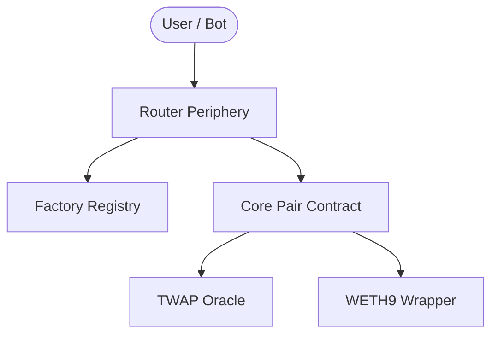

# Swap

**Swap** is a decentralized exchange (DEX) protocol based on the **Constant Product Market Maker (CPMM)** model. It enables trustless token swaps and automated liquidity provision using a peer-to-contract architecture.

## Key Capabilities

- **Efficient Swaps**: Swap any ERC20 pair with a competitive 0.3% fee.
- **Liquidity Provision**: Earn trading fees by providing liquidity and receiving fungible LP tokens.
- **Native ETH Integration**: Robust WETH wrapping allows seamless interaction with native Ether.
- **Advanced Pricing**: Integrated TWAP (Time-Weighted Average Price) oracle for manipulation-resistant on-chain pricing.
- **Optimistic Transfers**: Built-in support for Flash Swaps (borrow-and-repay in one transaction).

---

## Architecture

The system follows a modular architecture separating core logic from user-facing periphery:



---

## Protocol Mechanics

### The Constant Product Invariant
The core mechanism relies on the invariant $x \cdot y = k$, where $x$ and $y$ are the reserves of two tokens in a pool. This ensures that the product $k$ remains constant (excluding fees) during every trade.

### 1. Liquidity Provision
Liquidity Providers (LPs) deposit tokens in a 1:1 value ratio. The protocol mints LP tokens representing their fractional share of the pool:
$$\text{LP Tokens} = \sqrt{\text{amountA} \cdot \text{amountB}}$$

### 2. Pricing & Fees
A 0.3% fee is deducted from the input amount before executing the trade. The output is calculated as:
$$ \text{AmountOut} = \frac{\Delta x \cdot 0.997 \cdot y}{x + (\Delta x \cdot 0.997)} $$

### 3. Price Oracle (TWAP)
To prevent flash-loan attacks and price manipulation, the protocol records cumulative prices. External contracts can consult the oracle to get the average price over a specific time window:
$$\text{Average Price} = \frac{\text{PriceCumulative}_{\text{end}} - \text{PriceCumulative}_{\text{start}}}{\text{Time}_{\text{end}} - \text{Time}_{\text{start}}}$$

---

## Smart Contracts

| Contract        | Role        | Key Functionality                                      |
| :-------------- | :---------- | :----------------------------------------------------- |
| **Factory.sol** | Registry    | Standardized pool deployment via `CREATE2`.            |
| **Pair.sol**    | Core Engine | Reserve management, swap verification, LP token logic. |
| **Router.sol**  | Periphery   | Multi-hop routing, safety checks, and ETH handling.    |
| **Oracle.sol**  | Utility     | Accumulation and calculation of TWAP price feeds.      |
| **WETH9.sol**   | Wrapper     | Industry-standard Ether wrapping for gas efficiency.   |

---

## Security Features

- **Reentrancy Protection**: All state-changing core functions use a non-reentrant mutex.
- **Slippage Protection**: Guaranteed minimum output and maximum input parameters for every swap.
- **Deadline Enforcement**: Transactions expire if block timestamp exceeds user-defined limits.
- **Precision Engineering**: Minimized rounding errors to ensure the $k$ invariant is always strictly protected.

---

## Development & Deployment

### Tech Stack
- **Solidity**: ^0.8.24
- **Framework**: Foundry (Forge/Cast)
- **Library**: Solmate (for optimized math and gas performance)

### Fast Track Deployment

1. **Install Dependencies**
   ```bash
   git submodule update --init --recursive
   ```

2. **Spin up Local Environment**
   ```bash
   anvil
   ```

3. **Deploy to Local Cluster**
   ```bash
   forge script script/Deploy.s.sol --rpc-url http://127.0.0.1:8545 --broadcast --private-key 0xac0974bec39a17e36ba4a6b4d238ff944bacb478cbed5efcae784d7bf4f2ff80
   ```

---

## Quality Assurance

The codebase underwent rigorous verification with **69 high-fidelity tests** covering unit, integration, fuzzing, and invariant testing.

### Execution
```bash
forge test -vvv --gas-report
```

### Coverage Matrix
- **Foundational**: 20 Edge case and boundary condition tests.
- **Economic**: 10 Market simulation tests (Sandwich attacks, volatility).
- **Lifecycle**: 9 Liquidity provision and fee accumulation tests.
- **Complex**: 10 Multi-hop routing and efficiency tests.
- **Fuzzing**: Random input testing with thousands of iterations.
- **Invariants**: Reserve vs. Balance property verification.

---

## License

This project is licensed under the [MIT License](LICENSE).
